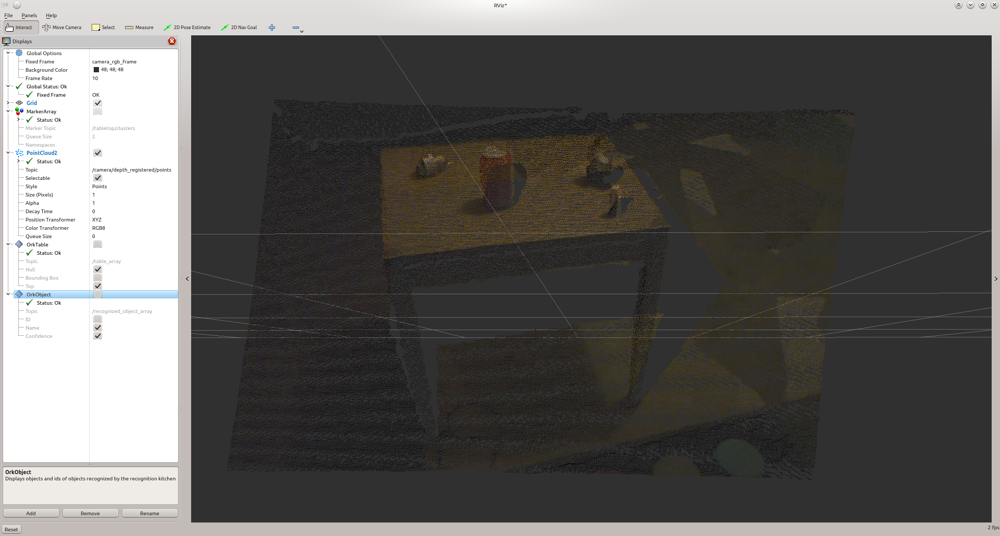

:orphan:

.. _tabletop:

object_recognition_tabletop: Tabletop Object Recognition
========================================================

Tabletop is a port of the method in http://www.ros.org/wiki/tabletop_object_detector originally developed by Marius Muja from the `FLANN <https://github.com/mariusmuja/flann>`_ fame.

This object detection method has two parts: a table finder and an object recognizer. The recognition part can only recognize objects that are rotationnally symmetric.
The sensor data that tabletop uses consists of a point cloud from the narrow stereo or Kinect cameras. tabletop performs the following steps:

 * segmentation: the table is detected by finding the dominant plane in the point cloud based on analysis of 3D normal vectors; points above the table are considered to belong to graspable objects. We use a clustering algorithm to identify individual objects. We refer to the points corresponding to an individual object as clusters.
 * recognition : for each cluster, a simple iterative fitting technique (a distant cousin of ICP) is used to see how well it corresponds to each mesh in our database of models. If a good fit is found, the database id of the model is returned along with the cluster; note that our current fitting method operates in 2D, since based on our assumptions (object resting upright on the known surface of the table) the other 4 dimensions are fixed.

Table Finder
------------

The table finder finds planes in the scene and segments out the objects on top of it. This part of this method can be useful in itself if you need the clusters as a pre-processing step for other object recognition techniques or if raw clusters are enough for you (for robot grasping for example).

.. toggle_table::
    :arg1: Non-ROS
    :arg2: ROS

To launch the pipeline, simply execute execute the following

.. toggle:: Non-ROS

    .. code-block:: sh

        ./detection -c ${PATH_TO_YOUR_TABLETOP_FOLDER}/conf/detection.table.ork

.. toggle:: ROS

    .. code-block:: sh

        rosrun object_recognition_ros server -c `rospack find object_recognition_tabletop`/conf/detection.table.ork

    In ROS mode, several topics are published:

       * a MarkerArray.msg for the clusters found on the planes as ``/tabletop/clusters``
       * a Table.msg for the different tables (the RViz ork plugin can help visualize those)

Object Finder
-------------

The part of the pipeline that recognizes objects functions as follows: it takes the clusters segmented from the previous stage, finds possible candidates in the database and then tries to match their meshes to the observed clusters during the final ICP step.

To perform these tasks tabletop relies the following assumptions:

 * the objects are resting on a table, which is the dominant plane in the scene
 * the minimum distance between two objects exceeds a given threshold (3cm in the demo)
 * in addition, object recognition can only handle 2 degrees of freedom: translation along the X and Y axes (with the Z axis assumed to be pointing "up" relative to the table). Therefore, in order to recognize an object:
 * it must be rotationally symmetric
 * it must have a known orientation, such as a glass or a bowl sitting "upright" on the table.

The output from this components consists of the location of the table, the identified point clusters, and the corresponding database object id and fitting pose for those clusters found to be similar to database objects.

Tabletop uses CouchDB database that contains details about the objects to be recognized. These details include the object id (generated automatically when the object is added to the database), object's name, object's author, object's tags object's 3D mesh. This 3D mesh will be used by tabletop during its recognition step. Setting up a CouchDB is explained here and managing objects is explained here.

Manage tabletop's input parameters
----------------------------------

tabletop manages a certain number of parameters, such as input image flow, database details, and detection thresholds, all of these parameters are defined in a configuration file, given as -c parameter in the tabletop command. The configuration file needs to be in YAML format.  An example of the configuration file for tabletop that process image published by openni_launch package is as below::

    source1:
      type: RosKinect
      module: 'object_recognition_ros.io' 
      parameters:
        rgb_frame_id: camera_rgb_optical_frame
        rgb_image_topic: /camera/rgb/image_rect_color
        rgb_camera_info: /camera/rgb/camera_info
        depth_image_topic: /camera/depth_registered/image_raw
        depth_camera_info: /camera/depth_registered/camera_info
    
    sink1:
      type: TablePublisher
      module: 'object_recognition_tabletop'
      inputs: [source1]
    
    sink2:
      type: Publisher
      module: 'object_recognition_ros.io'
      inputs: [source1]
    
    
    pipeline1:
      type: TabletopTableDetector
      module: 'object_recognition_tabletop'
      inputs: [source1]
      outputs: [sink1]
      parameters:
        table_detector:
            min_table_size: 4000
            plane_threshold: 0.01
    
    pipeline2:
      type: TabletopObjectDetector
      module: 'object_recognition_tabletop'
      inputs: [source1, pipeline1]
      outputs: [sink2]
      parameters:
        object_ids: 'all'
        tabletop_object_ids: 'REDUCED_MODEL_SET'
        threshold: 0.85
        db:
          type: CouchDB
          root: http://localhost:5984
          collection: object_recognition
          

'source1' defines image topics that tabletop needs for its detection steps. Basically, tabletop needs a depth image topic, a color image topic, and the camera information messages for these images as input.

'sink1' and 'sink2' defines how the output of tabletop can be processed further. In this example, they take care of publishing the detection results of tabletop.

'pipeline1' takes care of detecting planar surfaces.

'pipeline2' takes care of detecting objects on the main (detected) surface.

You can modify these parameters, such as input image topics, detection threshold, URI of the CouchDB to be used, etc. according to the setting you have in your project.

Example
-------

Here is what the scene looks like:

The pipeline then finds the planes and the clusters on top of it:

.. image:: example2.png
   :width: 100%

And it then identifies the clusters as objects in the database:

.. image:: example3.png
   :width: 100%

A video resuming the steps to run tabletop in ROS can be found `here <http://youtu.be/b_Ti3_4gY1I>`_.
